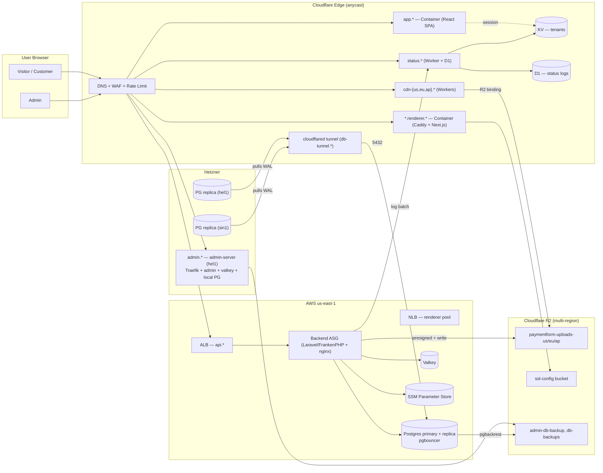
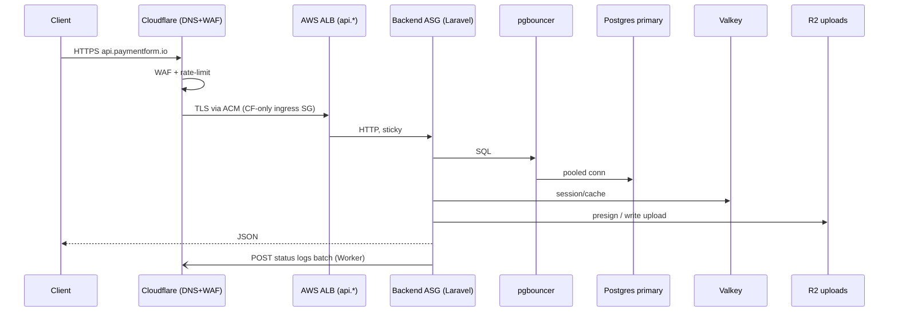
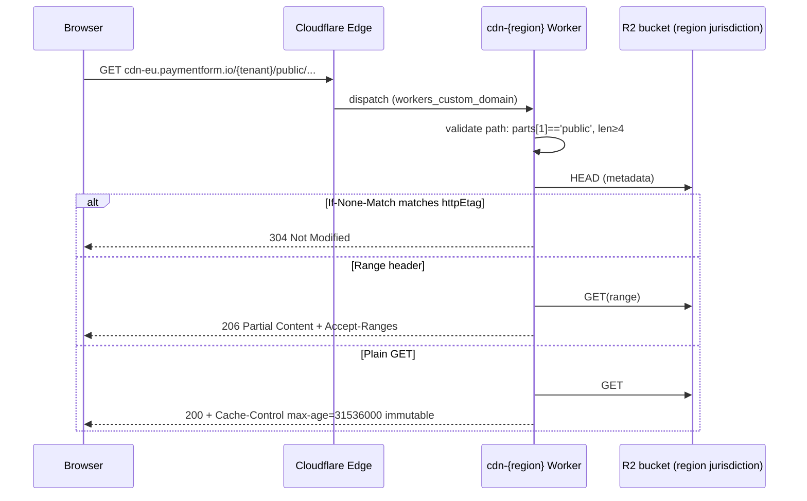
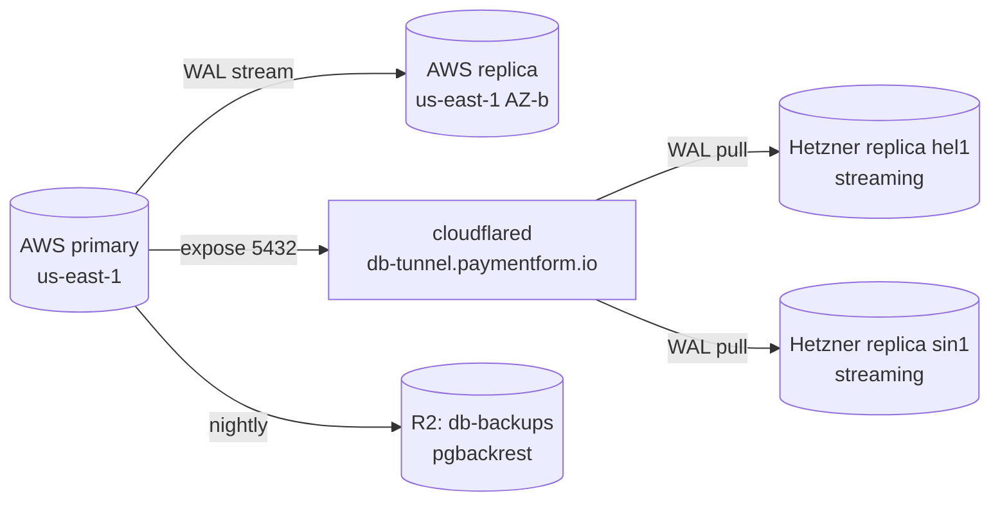

# Infrastructure as Code — PaymentForm

OpenTofu/Terraform managing PaymentForm's production stack across **AWS (us-east-1)**, **Cloudflare** (R2, Workers, KV, Containers, DNS, Tunnels, D1), and **Hetzner** (EU/AP replicas + admin server).

Single env: `environments/prod` (us-east-1). Provider modules live under `providers/<cloud>/<service>` and are composed from `environments/prod/main.tf`.

## Quick Start

```bash
cd environments/prod
cp terraform.tfvars.example terraform.tfvars   # fill in secrets
tofu init                                       # or: make init
tofu plan                                       # or: make plan
tofu apply                                      # or: make apply
```

## Common Commands

| Command | Description |
|---|---|
| `make init` | Initialize OpenTofu (downloads providers) |
| `make plan` | Generate execution plan |
| `make apply` | Apply planned changes |
| `make cost-estimate` | Estimate monthly costs (writes `cost-estimate-prod.json`) |
| `make state-list` | List all resources in state |
| `make output` | Print module outputs |
| `make validate` | Validate `.tf` syntax |
| `make fmt` | `terraform fmt` recursively |

## Repository Layout

```
iaac/
├── environments/
│   └── prod/                   # Wires every module — main.tf, tfvars, outputs
├── providers/
│   ├── aws/
│   │   ├── acm/                # ACM cert (api.*) via Cloudflare DNS validation
│   │   ├── alb/                # Application LB → backend (WS-safe, sticky)
│   │   ├── nlb/                # Network LB → renderer
│   │   ├── compute-alb/        # Backend ASG behind ALB
│   │   ├── compute-nlb/        # Renderer ASG behind NLB
│   │   ├── database/           # PostgreSQL primary + replica EC2 + pgbouncer
│   │   ├── valkey/             # Valkey/Redis EC2 instance
│   │   ├── volume/             # EBS data volumes
│   │   ├── networking/         # VPC, subnets, IGW, NAT
│   │   ├── security/           # SGs, IAM
│   │   ├── ssm/                # Encrypted parameter store helper
│   │   ├── vpc-peering/        # Cross-region VPC peering scaffold
│   │   ├── cloudtrail/         # Audit trail
│   │   └── route53-failover/   # DNS-level failover scaffold
│   ├── cloudflare/
│   │   ├── containers/         # Client (React SPA) + renderer containers
│   │   ├── dns/                # Records, WAF, rate limits, cache rules
│   │   ├── loadbalancer/       # CF LB for origin pools
│   │   ├── r2/
│   │   │   ├── application-storage/  # paymentform-uploads-{us,eu,ap}
│   │   │   ├── ssl-config/           # Caddy cert persistence
│   │   │   ├── public-files/         # Public asset bucket
│   │   │   ├── cdn-worker/           # Worker + custom-domain (cdn-{us,eu,ap})
│   │   │   └── worker/               # Worker source (index.js)
│   │   ├── kv/                 # Tenant session/state namespace
│   │   ├── status/             # Status page worker + D1 logs + KV incidents
│   │   ├── tunnel/             # General-purpose tunnels
│   │   └── tunnel-db/          # Postgres 5432 → Hetzner via tunnel
│   └── hetzner/
│       ├── admin-server/       # Admin app (Traefik + admin + valkey, hel1)
│       ├── server/             # Backend nodes (hel1, sin1) — currently dormant
│       ├── database/           # Postgres replica nodes (hel1, sin1)
│       ├── valkey/             # Valkey instances
│       └── network/            # Hetzner private networks
├── ansible/                    # Post-provision configuration
├── bootstrap/                  # First-run bootstrap (state backend, etc.)
├── loadtest/                   # k6 + Playwright load/E2E harness
├── scripts/                    # Operational helpers
└── docs/                       # Runbooks (deploy, db ops, CDN, DNS, …)
```

## High-Level Architecture



## Request Flow — Backend API



## Request Flow — CDN



## Database Replication



## Components

| Component | Module | Domain / Endpoint | Notes |
|---|---|---|---|
| Backend API | `aws/compute-alb` + `aws/alb` | `api.paymentform.io` | Laravel/FrankenPHP, ASG, ACM via CF DNS validation, CF-only ingress |
| Renderer | `aws/compute-nlb` + `aws/nlb` | `*.renderer.paymentform.io` | Caddy + Next.js, NLB, wildcard TLS via R2-stored certs |
| Client (Dashboard) | `cloudflare/containers` | `app.paymentform.io` | Cloudflare Container, React SPA (Vite + TanStack Router) |
| Admin App | `hetzner/admin-server` | `admin.paymentform.io` | hel1, Traefik + admin + valkey + local PG (barman → R2) |
| Postgres primary | `aws/database` | private | pgbouncer in front, EBS data volume, pgbackrest → R2 |
| Postgres replicas | `hetzner/database` × 2 | private | hel1 + sin1, WAL via CF tunnel |
| Valkey | `aws/valkey` | private | Session/queue/cache |
| Uploads (R2) | `cloudflare/r2/application-storage` | s3-compatible | `paymentform-uploads-{us,eu,ap}`; eu lives in `eu` jurisdiction |
| CDN | `cloudflare/r2/cdn-worker` | `cdn-{us,eu,ap}.paymentform.io` | Worker reads R2; supports 304, byte ranges, suffix ranges |
| Status Page | `cloudflare/status` | `status.paymentform.io` | Worker + D1 (log ingest) + KV (incidents); admin UI gated by `ADMIN_TOKEN` + IP/country ACL |
| KV (tenants) | `cloudflare/kv` | n/a | Tenant session/state |
| DB Tunnel | `cloudflare/tunnel-db` | `db-tunnel.paymentform.io` | cloudflared exposing 5432 for Hetzner replicas |
| DNS / WAF | `cloudflare/dns` | zone-wide | Records, rate limits, WAF, cache rules |
| ACM cert | `aws/acm` | `api.*` | DNS-01 via Cloudflare |
| CF LB | `cloudflare/loadbalancer` | configurable | Origin pools / health checks |

## Prerequisites

- **OpenTofu** ≥ 1.8 (or Terraform-compatible) and `make`
- **AWS CLI** with `us-east-1` access
- **Cloudflare API token** with scopes: Workers Scripts, Workers KV, Workers Routes, Workers R2, D1, DNS, Container Registry, SSL/TLS
- **Hetzner Cloud token** (`hcloud_token`)
- **GHCR PAT** (`read:packages`) for image pulls

## Required Variables (subset)

Set in `environments/prod/terraform.tfvars`. Full list in `terraform.tfvars.example`.

```hcl
cloudflare_api_token   = "..."
cloudflare_account_id  = "..."
cloudflare_zone_id     = "..."
hcloud_token           = "..."

# Container images (GHCR)
client_container_image   = "ghcr.io/bit-apps-pro/paymentform-client:vX.Y.Z"
renderer_container_image = "ghcr.io/bit-apps-pro/paymentform-renderer:vX.Y.Z"
backend_container_image  = "ghcr.io/bit-apps-pro/paymentform-backend:vX.Y.Z"

# Database
db_password         = "..."
admin_db_password   = "..."           # primary's superuser → tunnel/replicas
admin_local_db_password = "..."       # Hetzner admin server local PG
pgbackrest_cipher_pass  = "..."

# Storage (S3-compatible R2)
upload_storage_access_key_id     = "..."
upload_storage_secret_access_key = "..."
ssl_storage_access_key_id        = "..."
ssl_storage_secret_access_key    = "..."
backup_storage_access_key_id     = "..."
backup_storage_access_key        = "..."

# Status page
status_admin_token            = "..."
status_log_ingest_token       = "..."
status_admin_allowed_countries = "US,GB,..."
status_admin_allowed_ips      = "1.2.3.4,..."
```

## Provider Versions

Pinned across modules:

| Provider | Constraint |
|---|---|
| `cloudflare/cloudflare` | `~> 5.19` |
| `hashicorp/aws` | `~> 5.0` |
| `hetznercloud/hcloud` | `~> 1.49` |
| `hashicorp/null`, `random`, `archive`, `http` | `~> 3.0` / `~> 2.0` |

> **Note**: Cloudflare 5.16 had two production-breaking bugs ([d1 `read_replication` null](https://github.com/cloudflare/terraform-provider-cloudflare/issues/6309), [`workers_custom_domain` destroy/create drift](https://github.com/cloudflare/terraform-provider-cloudflare/issues/5618)). Stay on ≥ 5.19.

## Cost Estimate

Run `make cost-estimate` to refresh `cost-estimate-prod.json`. Snapshot ranges (excluding traffic):

| Resource | Monthly |
|---|---|
| AWS Backend ASG (compute-alb) | ~$30–60 |
| AWS Renderer ASG (compute-nlb) | ~$15–30 |
| AWS Postgres (primary + replica + EBS) | ~$40–80 |
| AWS Valkey | ~$10–20 |
| AWS ALB + NLB + data | ~$25–45 |
| Cloudflare Containers (client) | ~$10–15 |
| Cloudflare R2 (storage + ops) | ~$2–10 |
| Cloudflare Workers (cdn ×3 + status) | included on Workers plan |
| Hetzner admin (hel1) + replicas (hel1, sin1) | ~$30–50 |
| **Total (rough)** | **~$165–310/mo** |

## Operational Runbooks

See [`docs/README.md`](docs/README.md) for the full index. On-call should know these cold:

- **[Disaster Recovery](docs/disaster-recovery.md)** — RTO/RPO, node/primary/region/data-loss scenarios with step-by-step recovery + issues
- **[Autoscaling](docs/autoscaling.md)** — ASG behavior, manual scale, instance refresh, userdata sync, common alarms
- **[DB Replication (Ops)](docs/db-replication.md)** — monitor lag, restart, re-attach after failover, weekly health check
- **[DB Backup](docs/db-backup.md)** — pgbackrest + barman schedule, verify, manual backup, PITR restore, cipher rotation
- [Troubleshooting](docs/troubleshooting.md) — common ops issues

Reference / setup guides:

- [Deployment](docs/deploy.md) — bootstrap, plan/apply, rollback
- [Backend & Renderer Deploy](docs/backend-deploy.md) — image rollout via GitHub Actions
- [Database Operations](docs/database-operations.md) — EBS mount, replica promotion, barman/pgbackrest restore (referenced from DR / backup playbooks)
- [Database Replica Setup](docs/database-replica-setup.md) — first-time streaming replication setup
- [Database Tunnel & VPN](docs/database-tunnel-vpn.md) — connect remotely via cloudflared
- [CDN & R2 Storage](docs/cdn-storage.md) — buckets, regions, S3 API
- [CDN Worker](docs/cdn-worker.md) — worker code, R2 binding, custom domains
- [DNS & Routing](docs/dns.md) — geo-routing, WAF, rate limits, tunnels
- [Client Dashboard](docs/client.md) — container deploy, image updates, env vars
- [Performance Observe & Tune](docs/performance-observe-tune.md) — backend / PG / valkey tuning
- [Savings Plans Setup](docs/savings-plan-setup.md) — AWS Savings Plans

## Backend Auto-Deploy

Releases trigger `build-and-push-image.yml` (paymentform-backend) → `deploy-release.yml` runs in sequence:

- **AWS** instances: SSM `SendCommand` runs the deploy script on tagged ASG nodes
- **Hetzner** instances: SSH-in and run the deploy script

The deploy script detects environment (Docker vs systemd), pulls image, restarts, health-checks, and rolls back on failure.

Required GitHub secrets:

| Secret | Purpose |
|---|---|
| `AWS_DEPLOY_ROLE_ARN` | OIDC role assumed by the workflow |
| `GHCR_TOKEN` | `read:packages` PAT for image pull |
| `HETZNER_BACKEND_IPS` | Space-separated Hetzner IPs (active backends) |
| `HETZNER_SSH_KEY` | Private key authorized on those instances |

Manual run:

```bash
gh workflow run deploy-release.yml -f image_tag=v1.2.3
```

Rollback on-host:

```bash
curl -fsSL https://raw.githubusercontent.com/bit-apps-pro/paymentform-backend/main/.github/scripts/deploy.sh \
  | bash -s 'PREVIOUS_TAG' backend
```

## Conventions

- Resources tagged with `local.standard_tags` (env, app, owner). Add new tags there, not per-module.
- Module names in `environments/prod/main.tf` are stable — renaming breaks state. Use `tofu state mv` if unavoidable.
- Secrets never go in `.tf` or `.tfvars.example`; put them in `terraform.tfvars` (gitignored) or SSM.
- `tofu apply -target=...` and `-replace=...` are for recovery only, never routine.

## Support

Per-module specifics live in each provider directory. For incidents, start at [`docs/troubleshooting.md`](docs/troubleshooting.md).
